<h2>Лаба по контенерам</h2>
<details>
  <summary><h3>0. Пример с лекции</h3></summary>
  
  Будем последовательно добавлять элементы в `std::vector`, следить за изменением размерности вектора - `capacity` и `size`. Эти значения записываем в файл, после чего построим график зависимомти размерностей вектора от количества итераций(числа добавляемых элементов).

<details>
  <summary>"task0.cpp"</summary>

  ```C++
  #include <iostream>
  #include <fstream>
  #include <vector>
  
  int main() {
      std::vector<int> v;
      std::ofstream of("../0.csv", std::ios::out);
      for (int i = 0; i < 4096; i++) {
          v.push_back(i);
          if (i % 100 == 0) {
              of << v.capacity() << ' ' << v.size() << '\n';
          }
      }
      return 0;
  }
  ```
  
</details>


Видим, что значение `size` изменяется линейно в соответствии с добавляемыми элементами, а вот значение `capacity` - скачкообразно, сответствуют степеняв двойки (1, 2, 4, 8, 16, 32, 64,..). Так происходит из-за того, что `size` - занимаемое место в векторе, соответственно, если мы добавили 1 элемент, то этот параметр увеличился на единицу. А вот `capacity` - это место, которое впринципе выделено под вектор, соотвественно, при достижении верхней границы этого места этот параметр автоматически увеличивается. А поскольку трудоёмко каждый раз увеличивать место на единицу, то этот параметр увеличивается с запасом.
  
</details>

<details>
  <summary><h3>1. Среднее время вставки элемента в произвольное место вектора</h3></summary>

Напишем свой `subvector`, помимо прочих методов, реализуем нужный нам метод `insert` - добавление элемента на конкретную позицию.

```C++
void Subvector::insert(int pos, int value) {
    if (this->top > this->capacity) {
        this->resize(this->top * 2 + 1);
    }
    for (unsigned int i = this->top - 1; i > pos; i--) {
        this->mas[i + 1] = this->mas[i];
    }
    this->mas[pos + 1] = this->mas[pos];
    this->top++;
    this->mas[pos] = value;
}
```

Будем тестировать наш метод `insert` для нашего `subvector`, а так же стандартный `insert` для `std::vector`. Для этого будем добавлять элемент, стая его на первое (нулевое) место, а так же будем засекать время работы этих методов, а потом строить график зависимости времени выполнения от размера вектора/сабвектора.

<details>
  <summary>"task1.cpp"</summary>

```C++
#include <iostream>
#include <vector>
#include <fstream>
#include <random>
#include <chrono>
#include "subvector.h"

double get_time() {
    return std::chrono::duration_cast<std::chrono::microseconds>(
            std::chrono::steady_clock::now().time_since_epoch()).count() / 1e6;
}

int rand_uns(int min, int max) {
    unsigned seed = std::chrono::steady_clock::now().time_since_epoch().count();
    static std::default_random_engine e(seed);
    std::uniform_int_distribution<int> d(min, max);
    return d(e);
}

int main() {
    std::ofstream f1("../1_1.csv", std::ios::out);
    std::ofstream f2("../1_2.csv", std::ios::out);

    Subvector subv;
    std::vector<int> v;
    for (int i = 0; i < 1048576; i++) {
        int value = rand_uns(0, 100);
        subv.push_back(value);
        v.push_back(value);
        if (i % 1000 == 0) {
            int new_value = rand_uns(0, 100);
            //int new_pos = rand_uns(0, subv.getTop());
            int new_pos = 0;
            auto start = get_time();
            subv.insert(new_pos, new_value);
            auto finish = get_time();
            auto time = finish - start;
            f1 << subv.getTop() << " " << time << "\n";

            start = get_time();
            v.insert(v.begin() + new_pos, new_value);
            finish = get_time();
            time = finish - start;
            f2 << v.size()<< " " << time << "\n";
        }
    }

    std::cout << subv.getCapacity() << '\n';

    return 0;
}
```
</details>

Итак, график для `subvector`:


Можем точно сказать, что ассимптотика нашего метода `insert` равна **O(N)**. Это и очевидно, поскольку для того, чтобы добавить элемент, нам нужно передвинуть весь сабвектор на одну позицию.

И график для `std::vector`:


Здесь так же ассимптотика составляет **O(N)**. Мы так же можем наблюдать некоторый излом - это происходит из-за больших данных. В общей картине - ничего не меняется.
  
</details>


<details>
  <summary><h3>2. Среднее время удаления одного элемента из произвольного места вектора</h3></summary>

Дополним предыдущий вектор, реализовав нужный нам метод `erase` - удаление элемента из конкретной позиции.

```C++
void Subvector::erase(int pos) {
    for (unsigned int i = pos; i < this->getTop() - 1; i++) {
        this->mas[i] = this->mas[i+1];
    }
    this->top--;
}
```

Будем тестировать наш метод `erase` для нашего `subvector`, а так же стандартный `erase` для `std::vector`. Для этого сначала заполним наши контейнера набором одинаковых чисел, а затем будем постепенно удалять первый (нулевой) элемент. Во время использования метода будем засекать время, а затем построим график зависимости времени выполнения от размера вектора/сабвектора.

<details>
  <summary>"task2.cpp"</summary>

```C++
#include <iostream>
#include <vector>
#include <fstream>
#include <random>
#include <chrono>
#include "subvector.h"

double get_time() {
    return std::chrono::duration_cast<std::chrono::microseconds>(
            std::chrono::steady_clock::now().time_since_epoch()).count() / 1e6;
}

int rand_uns(int min, int max) {
    unsigned seed = std::chrono::steady_clock::now().time_since_epoch().count();
    static std::default_random_engine e(seed);
    std::uniform_int_distribution<int> d(min, max);
    return d(e);
}

int main() {
    std::ofstream f1("../2_1.csv", std::ios::out);
    std::ofstream f2("../2_2.csv", std::ios::out);

    Subvector subv;
    std::vector<int> v;
    for (int i = 0; i < 262144; i++) {
        int value = rand_uns(0, 100);
        subv.push_back(value);
        v.push_back(value);
    }
    for (int i = 0; i < 262144; i++) {
        std::cout << i << '\n';
        if (i % 1000 != 0) {
            subv.erase(0);
            v.erase(v.begin());
        }
        else if (i % 1000 == 0) {
            auto start = get_time();
            subv.erase(0);
            auto finish = get_time();
            auto time = finish - start;
            f1 << subv.getTop() << " " << time << "\n";

            start = get_time();
            v.erase(v.begin());
            finish = get_time();
            time = finish - start;
            f2 << v.size()<< " " << time << "\n";
        }
    }

    return 0;
}
```
</details>

Итак, график для `subvector`:

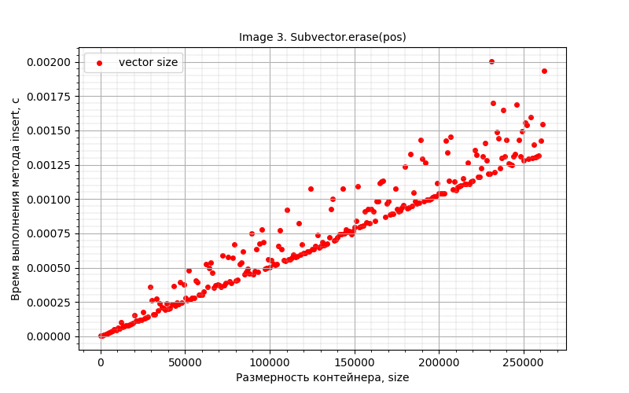

Можем точно сказать, что ассимптотика нашего метода `erase` равна **O(N)**. Это и очевидно, поскольку для того, чтобы удалить элемент, нам нужно передвинуть весь сабвектор на одну позицию.

И график для `std::vector`:

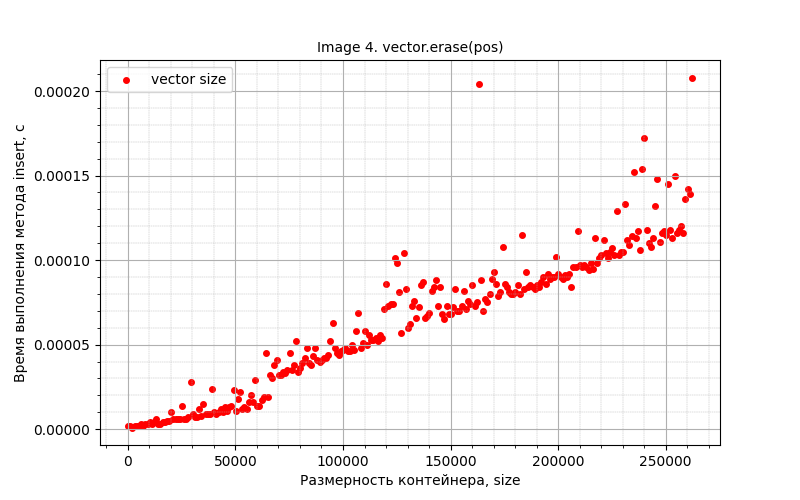

Здесь так же ассимптотика составляет **O(N)**. Мы так же можем наблюдать некоторый излом - это происходит из-за больших данных. В общей картине - опять же ничего не меняется.
  
</details>

<details>
  <summary><h3>3. Среднее время добавления в начало односвязного списка</h3></summary>

Будем тестировать односвязные списки, такие как `list`, `forward_list` и написанный нами `subforwardlist`. А точнее будем тестировать их метод `push_front`: будем последовательно добавлять в контейнер элементы и записывать время работы метода. Затем построим график зависимости времени работы метода в зависимости от размера контейнера.

<details>
  <summary>"task3.cpp"</summary>

```C++
#include <iostream>
#include <list>
#include <forward_list>
#include <fstream>
#include <random>
#include <chrono>

struct subforwardlist {
    int data;
    subforwardlist* next;
};

bool init(subforwardlist **sfl) {
    *sfl = NULL;
    return 0;
}

void push_forward(subforwardlist **sfl, int d) {
    subforwardlist* start = new subforwardlist();
    start->data = d;
    start->next = (*sfl);
    (*sfl) = start;
}

void pop_forward(subforwardlist **sfl) {
    if (  *sfl  ) {
        subforwardlist *p = (*sfl)->next;
        delete *sfl;
        (*sfl) = p;
    }
}

void clear(subforwardlist **sfl) {
    if (  !(*sfl)  ) return;
    while (*sfl) {
        pop_forward(sfl);
    }
    (*sfl) = NULL;
}

double get_time() {
    return std::chrono::duration_cast<std::chrono::microseconds>(
            std::chrono::steady_clock::now().time_since_epoch()).count() / 1e6;
}

int rand_uns(int min, int max) {
    unsigned seed = std::chrono::steady_clock::now().time_since_epoch().count();
    static std::default_random_engine e(seed);
    std::uniform_int_distribution<int> d(min, max);
    return d(e);
}

int main() {
    std::ofstream f1("../3_1.csv", std::ios::out);
    std::ofstream f2("../3_2.csv", std::ios::out);
    std::ofstream f3("../3_3.csv", std::ios::out);

    std::list<int> l;
    std::forward_list<int> fl;
    subforwardlist *sfl;
    init(&sfl);
    for (int i = 0; i < 16777216; i++) {
        int value = rand_uns(0, 100);
        l.push_front(value);
        fl.push_front(value);
        push_forward(&sfl, value);
        if (i % 1000 == 0) {
            int new_value = rand_uns(0, 100);

            auto start = get_time();
            l.push_front(new_value);
            auto finish = get_time();
            auto time = finish - start;
            f1 << l.size() << " " << time << "\n";

            start = get_time();
            fl.push_front(new_value);
            finish = get_time();
            time = finish - start;
            f2 <<  i + i/1000 << " " << time << "\n";

            start = get_time();
            push_forward(&sfl, new_value);
            finish = get_time();
            time = finish - start;
            f3 << i + i/1000 << " " << time << "\n";
        }
    }

    clear(&sfl);
    return 0;
}
```
</details>

График для `std::list`:

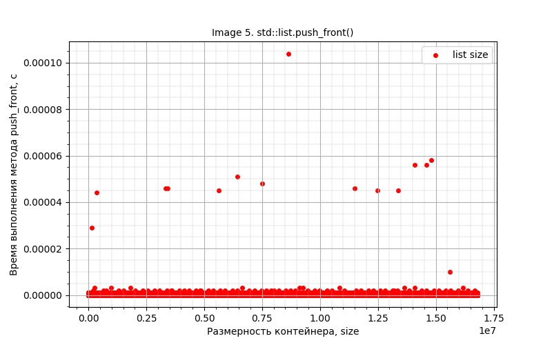

Из графика можем определить ассимптотику - **O(1)**. Действительно, для работы этого метода необходимо просто выделить ячейку памяти, куда запишется добавляемое значение, а затем перевесить указатели так, чтобы новая ячейка стала первый (нулевым) элементом контейнера.

График для `std::forward_list`:

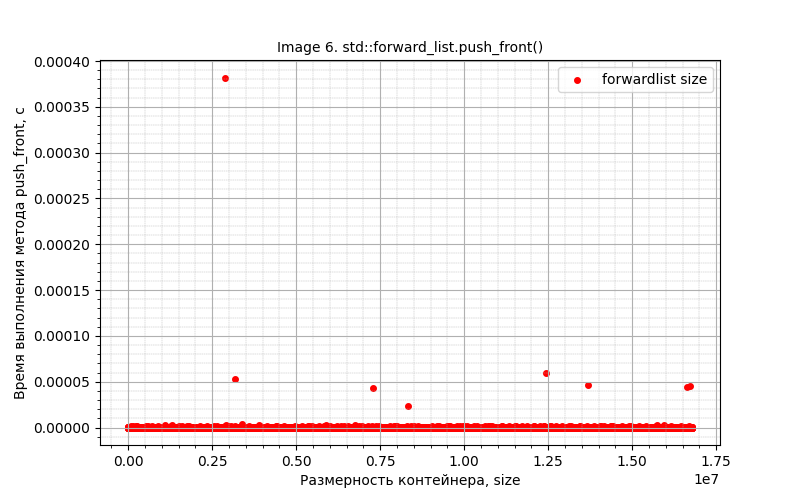

Аналогично, ассимптотика **O(1)**. Соображения те же самые.

И график для `std::subforwardlist`:

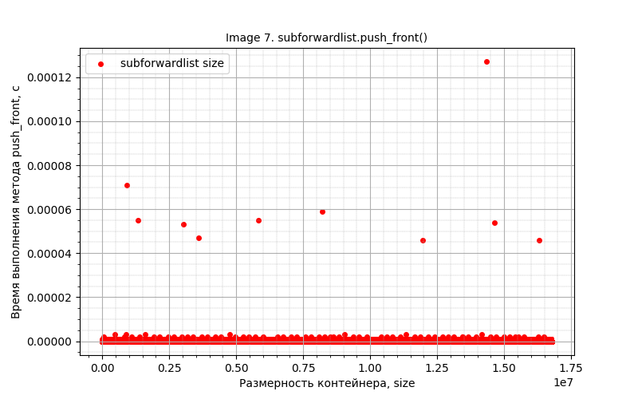

Аналогично, ассимптотика **O(1)**. Соображения те же самые.

P.s.: в некоторых случаях может получиться так, что график представляет собой несколько прямых - квантование. Это не страшно, ассимптотику это не меняет. Чтобы от этого избавиться, необходимо усреднять значения.

P.s.: для `subforwardlist` я не применял методы ООП, пользовался структурой и функциями для неё.

</details>

<details>
  <summary><h3>4. Среднее время удаления из начала односвязного списка</h3></summary>

Продолжим тестировать `list`, `forward_list` и написанный нами `subforwardlist`. Теперь будем тестировать их метод `pop_front`: сначала заполним их одинаковыми элементами, а затем будем последовательно удалять из контейнера элементы и записывать время работы метода. Затем построим график зависимости времени работы метода в зависимости от размера контейнера.

<details>
<summary>"task4.cpp"</summary>

```C++
#include <iostream>
#include <list>
#include <forward_list>
#include <fstream>
#include <random>
#include <chrono>

struct subforwardlist {
    int data;
    subforwardlist* next;
};

bool init(subforwardlist **sfl) {
    *sfl = NULL;
    return 0;
}

void push_forward(subforwardlist **sfl, int d) {
    subforwardlist* start = new subforwardlist();
    start->data = d;
    start->next = (*sfl);
    (*sfl) = start;
}

void pop_forward(subforwardlist **sfl) {
    if (  *sfl  ) {
        subforwardlist *p = (*sfl)->next;
        delete *sfl;
        (*sfl) = p;
    }
}

void clear(subforwardlist **sfl) {
    if (  !(*sfl)  ) return;
    while (*sfl) {
        pop_forward(sfl);
    }
    (*sfl) = NULL;
}

double get_time() {
    return std::chrono::duration_cast<std::chrono::microseconds>(
            std::chrono::steady_clock::now().time_since_epoch()).count() / 1e6;
}

int rand_uns(int min, int max) {
    unsigned seed = std::chrono::steady_clock::now().time_since_epoch().count();
    static std::default_random_engine e(seed);
    std::uniform_int_distribution<int> d(min, max);
    return d(e);
}

int main() {
    std::ofstream f1("../3_1.csv", std::ios::out);
    std::ofstream f2("../3_2.csv", std::ios::out);
    std::ofstream f3("../3_3.csv", std::ios::out);

    std::list<int> l;
    std::forward_list<int> fl;
    subforwardlist *sfl;
    init(&sfl);
    for (int i = 0; i < 16777216; i++) {
        int value = rand_uns(0, 100);
        l.push_front(value);
        fl.push_front(value);
        push_forward(&sfl, value);
        if (i % 1000 == 0) {
            int new_value = rand_uns(0, 100);

            auto start = get_time();
            l.push_front(new_value);
            auto finish = get_time();
            auto time = finish - start;
            f1 << l.size() << " " << time << "\n";

            start = get_time();
            fl.push_front(new_value);
            finish = get_time();
            time = finish - start;
            f2 <<  i + i/1000 << " " << time << "\n";

            start = get_time();
            push_forward(&sfl, new_value);
            finish = get_time();
            time = finish - start;
            f3 << i + i/1000 << " " << time << "\n";
        }
    }

    clear(&sfl);
    return 0;
}
```
</details>

График для `std::list`:

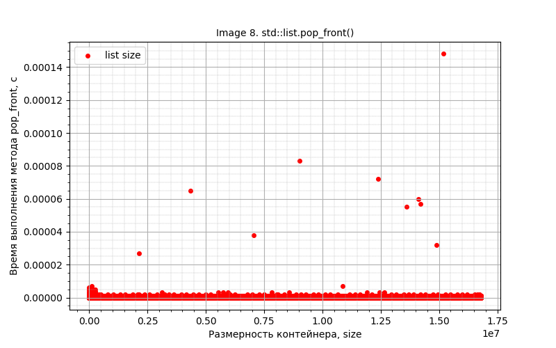

Из графика можем определить ассимптотику - **O(1)**. Действительно, для работы этого метода необходимо просто переставить указатель на первую (нулевую) ячейку, а исходно первую (нулевую) ячейку очистить при необходимости.

График для `std::forward_list`:

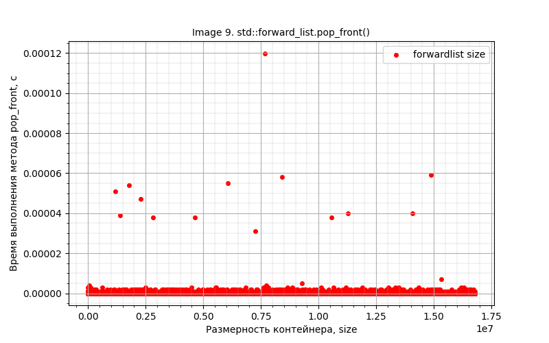

Аналогично, ассимптотика **O(1)**. Соображения те же самые.

И график для `std::subforwardlist`:

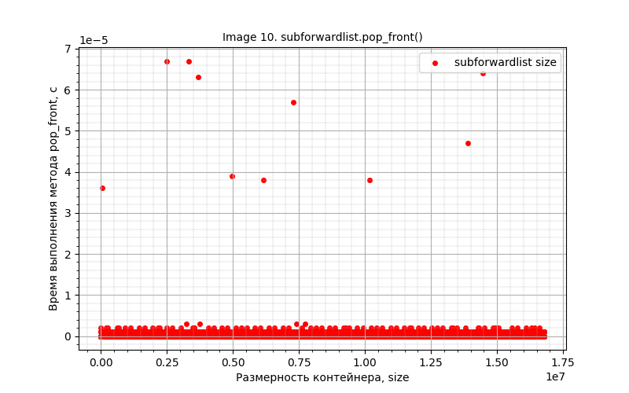

Аналогично, ассимптотика **O(1)**. Соображения те же самые.

P.s.: здесь уже квантование выражено ярче, но исправлять не буду - ассимптотика проследивается сразу. Это не страшно, ассимптотику это не меняет. Чтобы от этого избавиться, необходимо усреднять значения.

P.s.: для `subforwardlist` я не применял методы ООП, пользовался структурой и функциями для неё.
  
</details>

<details>
  <summary><h3>5. Среднее время добавления элемента в бинарное дерево</h3></summary>

Будем тестировать контейнеры, основанные на работе бинарного дерева. Это `set`, `map`, 'multiset` и 'multimap`. Здесь квантование выражено сильнее, поэтому усреднять точно надо. Будет поочерёдно для каждого контейнера добавлять элементы, через каждую 1000 элементов фиксировать среднее время работы метода `insert`. Далее строим графики зависимости времени работы этого метода от размера контейнера.

<details>
  <summary>"task5.cpp"</summary>

```C++
#include <iostream>
#include <set>
#include <map>
#include <fstream>
#include <random>
#include <chrono>

double get_time() {
    return std::chrono::duration_cast<std::chrono::microseconds>(
            std::chrono::steady_clock::now().time_since_epoch()).count() / 1e6;
}

int rand_uns(int min, int max) {
    unsigned seed = std::chrono::steady_clock::now().time_since_epoch().count();
    static std::default_random_engine e(seed);
    std::uniform_int_distribution<int> d(min, max);
    return d(e);
}

int main() {
    std::ofstream f1("../5_1.csv", std::ios::out);
    std::ofstream f2("../5_2.csv", std::ios::out);
    std::ofstream f3("../5_3.csv", std::ios::out);
    std::ofstream f4("../5_4.csv", std::ios::out);

    std::set<int> s;
    std::map<int, int> m;
    std::multiset<int> ms;
    std::multimap<int, int> mm;

    bool record = false;
    auto start = get_time();
    for (int i = 0; i < 16777216; i++) {
        if (!record) {
            start = get_time();
            record = true;
        }
        s.insert(i);
        if (i != 0 and i % 10000 == 0) {
            auto finish = get_time();
            auto time = (finish - start) / 10000;

            f1 << s.size() << " " << time << "\n";
            record = false;
        }
    }

    record = false;
    start = get_time();
    for (int i = 0; i < 16777216; i++) {
        if (!record) {
            start = get_time();
            record = true;
        }
        m.insert({i, i});
        if (i != 0 and i % 10000 == 0) {
            auto finish = get_time();
            auto time = (finish - start) / 10000;

            f2 << m.size() << " " << time << "\n";
            record = false;
        }
    }

    record = false;
    start = get_time();
    for (int i = 0; i < 16777216; i++) {
        if (!record) {
            start = get_time();
            record = true;
        }
        ms.insert(i);
        if (i != 0 and i % 10000 == 0) {
            auto finish = get_time();
            auto time = (finish - start) / 10000;

            f3 << ms.size() << " " << time << "\n";
            record = false;
        }
    }

    record = false;
    start = get_time();
    for (int i = 0; i < 16777216; i++) {
        if (!record) {
            start = get_time();
            record = true;
        }
        mm.insert({i, i});
        if (i != 0 and i % 10000 == 0) {
            auto finish = get_time();
            auto time = (finish - start) / 10000;

            f4 << mm.size() << " " << time << "\n";
            record = false;
        }
    }

    return 0;
}

```
</details>

График для `std::set`:

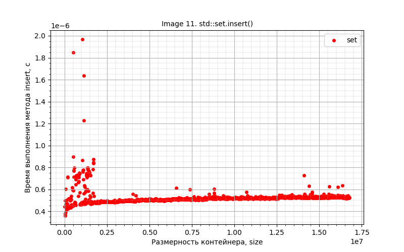

Из графика прослеживается ассимптотика **O(logN)**. Это мы и ожидали, потому что бинарное дерево работает на основе бинарного поиска. Соответсвенно, и ассимптотака такая же. МЫ ищем нужную нам ветку, куда неообходимо добавить элемент, перекрепив указатели.

График для `std::map`:

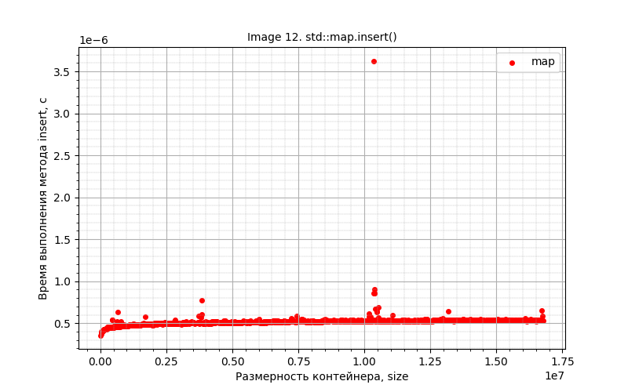

Аналогично, ассимптотика **O(logN)**. Соображения те же самые.

График для `std::multiset`:

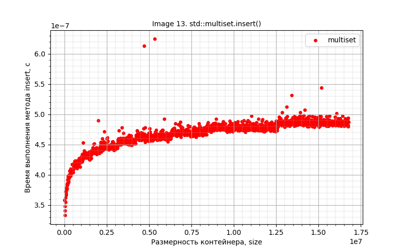

Аналогично, ассимптотика **O(logN)**. Соображения те же самые. На этом контейнере особенно хорошо видна зависимость.

График для `std::multimap`:

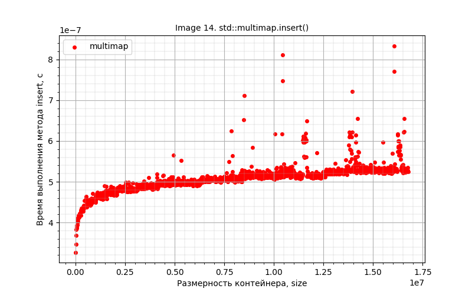

Аналогично, ассимптотика **O(logN)**. Соображения те же самые. На этом контейнере особенно хорошо видна зависимость.

  
</details>
