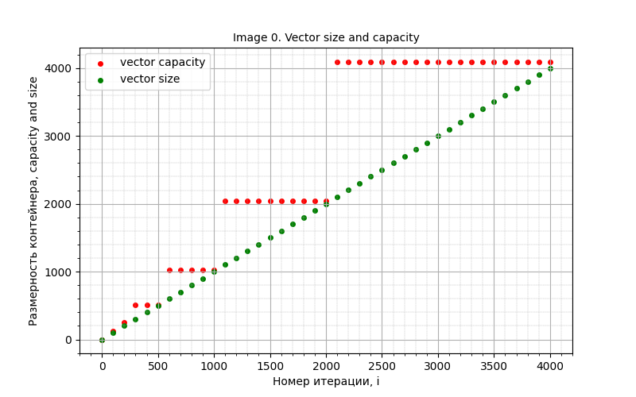
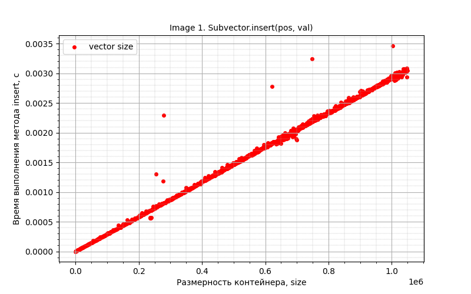
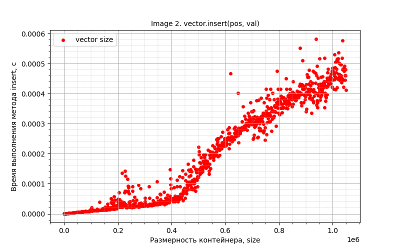

<h2>Лаба по контенерам</h2>
<details>
  <summary><h3>1. Пример с лекции</h3></summary>
  
  Будем последовательно добавлять элементы в `std::vector`, следить за изменением размерности вектора - `capacity` и `size`. Эти значения записываем в файл, после чего построим график зависимомти размерностей вектора от количества итераций(числа добавляемых элементов).

<details>
  <summary>"task0.cpp"</summary>

  ```C++
  #include <iostream>
  #include <fstream>
  #include <vector>
  
  int main() {
      std::vector<int> v;
      std::ofstream of("../0.csv", std::ios::out);
      for (int i = 0; i < 4096; i++) {
          v.push_back(i);
          if (i % 100 == 0) {
              of << v.capacity() << ' ' << v.size() << '\n';
          }
      }
      return 0;
  }
  ```
  
</details>



Видим, что значение `size` изменяется линейно в соответствии с добавляемыми элементами, а вот значение `capacity` - скачкообразно, сответствуют степеняв двойки (1, 2, 4, 8, 16, 32, 64,..). Так происходит из-за того, что `size` - занимаемое место в векторе, соответственно, если мы добавили 1 элемент, то этот параметр увеличился на единицу. А вот `capacity` - это место, которое впринципе выделено под вектор, соотвественно, при достижении верхней границы этого места этот параметр автоматически увеличивается. А поскольку трудоёмко каждый раз увеличивать место на единицу, то этот параметр увеличивается с запасом.
  
</details>

<details>
  <summary><h3>2. Среднее время вставки элемента в произвольное место вектора</h3></summary>

Напишем свой `subvector`, помимо прочих методов, реализуем нужный нам метод `insert` - добавление элемента на конкретную позицию.

<details>
  <summary>"subvector.h"</summary>

```C++
#ifndef LAB_WORK_STL_SUBVECTOR_H
#define LAB_WORK_STL_SUBVECTOR_H


class Subvector {
public:
    // инициализация пустого недовектора (top и capacity по нулям, а mas это NULL)
    Subvector();

    // добавление элемента в конец недовектора с выделением дополнительной памяти при необходимости
    bool push_back(int d);

    // удаление элемента с конца недовектора, значение удаленного элемента вернуть (если недовектор пустой, вернуть ноль)
    int pop_back();

    // увеличить емкость недовектора (можно использовать и для уменьшения - тогда, в рамках данной реализации, если top
    //больше новой capacity, то копируем только то, что влезает, и уменьшаем top до capacity)
    bool resize(unsigned int new_capacity);

    // очистить неиспользуемую память, переехав на новое место с уменьшением capacity до top
    void shrink_to_fit();

    // очистить содержимое недовектора, занимаемое место при этом не меняется
    void clear();

    // очистить всю используемую память, инициализировать недовектор как пустой
    void destructor();

    //добавление элемента в конкретное место вектора
    void insert(int pos, int value);

    //вывод top
    unsigned int getTop() const;

    //вывод capacity
    unsigned int getCapacity() const;

    //вывод вектора
    void print();

private:
    int *mas;
    unsigned int top;
    unsigned int capacity;
};


#endif //LAB_WORK_STL_SUBVECTOR_H
```

</details>

<details>
  <summary>"subvector.cpp"</summary>

```C++
#include <iostream>
#include "subvector.h"

Subvector::Subvector() {
    this->capacity = 0;
    this->top = 0;
    this->mas = NULL;
};

bool Subvector::push_back(int d) {
    if (this->top + 1 > this->capacity) {
        this->resize(this->top * 2 + 1);
    }
    (this->mas)[this->top] = d;
    (this->top)++;
    return true;
};

int Subvector::pop_back() {
    if (this->top == 0) return 0;
    (this->top)--;
    return (this->mas)[this->top];
};

bool Subvector::resize(unsigned int new_capacity) {
    this->capacity = new_capacity;
    int *tmp = new int[new_capacity];
    if (this->top > new_capacity) {
        this->top = new_capacity;
    }
    for (unsigned int i = 0; i < this->top; i++) {
        tmp[i] = (this->mas)[i];
    }
    delete[] this->mas;
    this->mas = tmp;
    return true;
};

void Subvector::shrink_to_fit() {
    this->capacity = this->top;
    int *tmp = new int[this->top];
    for (unsigned int i = 0; i < this->top; i++) {
        tmp[i] = (this->mas)[i];
    }
    delete[] this->mas;
    this->mas = tmp;
};

void Subvector::clear() {
    this->top = 0;
};

void Subvector::destructor() {
    delete[] this->mas;
    Subvector();
};

void Subvector::insert(int pos, int value) {
    if (this->top > this->capacity) {
        this->resize(this->top * 2 + 1);
    }
    for (unsigned int i = this->top - 1; i > pos; i--) {
        this->mas[i + 1] = this->mas[i];
    }
    this->mas[pos + 1] = this->mas[pos];
    this->top++;
    this->mas[pos] = value;
}

unsigned int Subvector::getTop() const {
    return this->top;
}

unsigned int Subvector::getCapacity() const {
    return this->capacity;
}

void Subvector::print() {
    for (unsigned int i = 0; i < this->top; i++) {
        std::cout << this->mas[i] << ' ';
    }
    std::cout << '\n';
}

```
</details>

<details>
  <summary>(отдельно) Subvector::insert() {}</summary>

```C++
void Subvector::insert(int pos, int value) {
    if (this->top > this->capacity) {
        this->resize(this->top * 2 + 1);
    }
    for (unsigned int i = this->top - 1; i > pos; i--) {
        this->mas[i + 1] = this->mas[i];
    }
    this->mas[pos + 1] = this->mas[pos];
    this->top++;
    this->mas[pos] = value;
}
```
</details>

Будем тестировать наш метод `insert` для нашего `subvector`, а так же стандартный `insert` для `std::vector`. Будем засекать время работы этих методов, а потом строить график зависимости времени выполнения от размера вектора/сабвектора.

<details>
  <summary>"task1.cpp"</summary>

```C++
#include <iostream>
#include <vector>
#include <fstream>
#include <random>
#include <chrono>
#include "subvector.h"

double get_time() {
    return std::chrono::duration_cast<std::chrono::microseconds>(
            std::chrono::steady_clock::now().time_since_epoch()).count() / 1e6;
}

int rand_uns(int min, int max) {
    unsigned seed = std::chrono::steady_clock::now().time_since_epoch().count();
    static std::default_random_engine e(seed);
    std::uniform_int_distribution<int> d(min, max);
    return d(e);
}

int main() {
    std::ofstream f1("../1_1.csv", std::ios::out);
    std::ofstream f2("../1_2.csv", std::ios::out);

    Subvector subv;
    std::vector<int> v;
    for (int i = 0; i < 1048576; i++) {
        int value = rand_uns(0, 100);
        subv.push_back(value);
        v.push_back(value);
        if (i % 1000 == 0) {
            int new_value = rand_uns(0, 100);
            //int new_pos = rand_uns(0, subv.getTop());
            int new_pos = 0;
            auto start = get_time();
            subv.insert(new_pos, new_value);
            auto finish = get_time();
            auto time = finish - start;
            f1 << subv.getTop() << " " << time << "\n";

            start = get_time();
            v.insert(v.begin() + new_pos, new_value);
            finish = get_time();
            time = finish - start;
            f2 << v.size()<< " " << time << "\n";
        }
    }

    std::cout << subv.getCapacity() << '\n';

    return 0;
}
```
</details>

Итак, график для `subvector`:


Итак, график для `std::vector`:

  
</details>
